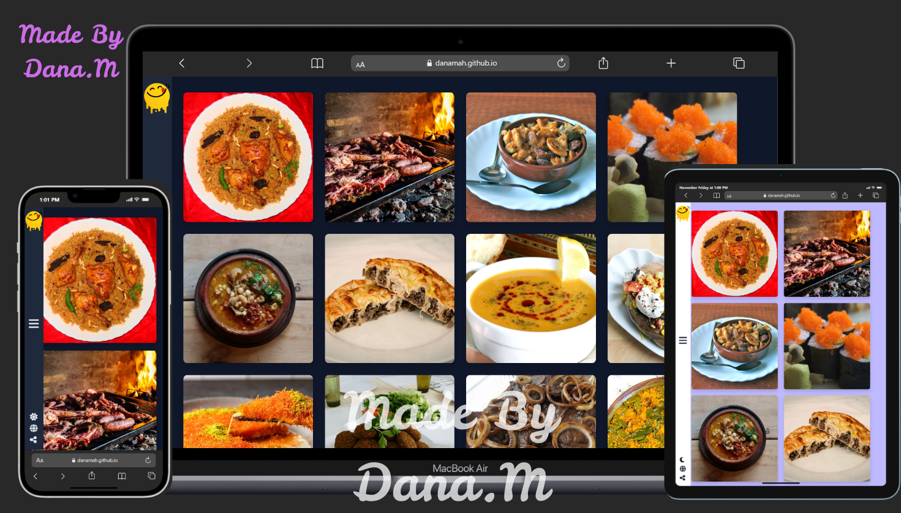

# Yummy Meals 🍔🍕 - TheMealDB API Project



> Responsive meals website built with HTML, CSS, JavaScript and Bootstrap 5.  
> Fully functional search, categories, area, ingredients filter and contact form with real-time validation.

**Live Demo**: https://danamah.github.io/Yummy-Website/

## ✨ Features

- 🔍 Search by name or first letter (Live Search)
- 🏷️ Filter meals by Category, Area, Ingredients
- 🍽️ Meal details page with recipes, tags, source & YouTube links
- 📱 Fully responsive design (Mobile + Tablet + Desktop)
- 🎨 Dark/Light mode with localStorage
- 📧 Contact form with real-time Regex validation
- ⚡ Loading screen + Smooth animations (GSAP + Anime.js)
- 🚀 No framework – Pure Vanilla JS + Bootstrap 5

## 🛠️ Technologies Used

| Technology       | Version    | Purpose                  |
|---------------|----------|--------------------------|
| HTML5         | -        | Structure                |
| CSS3          | -        | Styling + Dark Mode      |
| Bootstrap     | 5.3      | Responsive Grid & Components |
| JavaScript    | ES6+     | Logic & API Calls        |
| GSAP          | 3.12     | Sidebar Animations       |
| Anime.js      | 3.2      | Footer Icons Animation   |
| TheMealDB API | Free     | Meals Data               |

## 🚀 How to Run Locally

1. Clone the repository
```bash
git clone https://github.com/danamah/Yummy-Website.git
